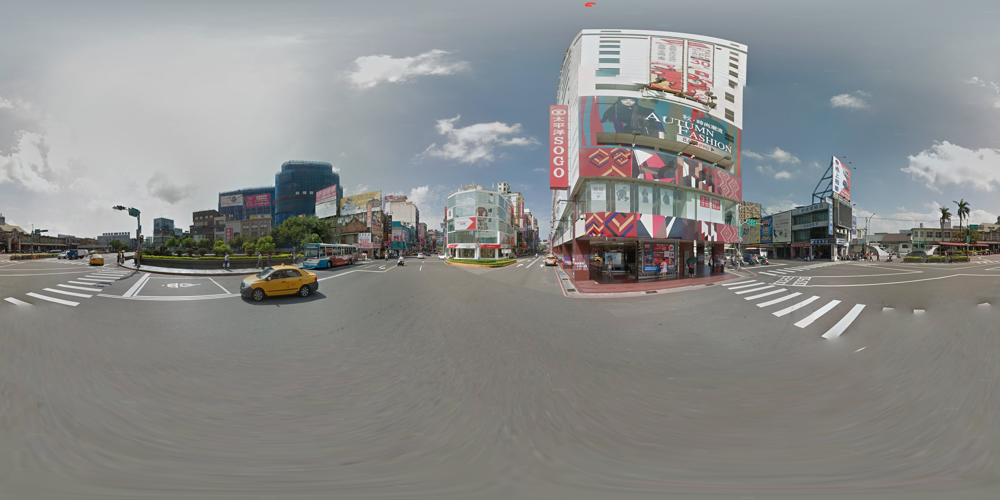

# Equirec2Perspec
## Introduction
<strong>Equirec2Perspec</strong> is a python tool to split equirectangular panorama into normal perspective view.

## Panorama
Given an input of 360 degree panorama
<center></center>

## Perpective
Split panorama into perspective view with given parameters
<center></center>

## Usage
```python
import os
import cv2 
import Equirec2Perspec as E2P 

if __name__ == '__main__':
    equ = E2P.Equirectangular('src/image.jpg')    # Load equirectangular image
    
    #
    # FOV unit is degree 
    # theta is z-axis angle(right direction is positive, left direction is negative)
    # phi is y-axis angle(up direction positive, down direction negative)
    # height and width is output image dimension 
    #
    img = equ.GetPerspective(60, 0, 0, 720, 1080) # Specify parameters(FOV, theta, phi, height, width)
```

